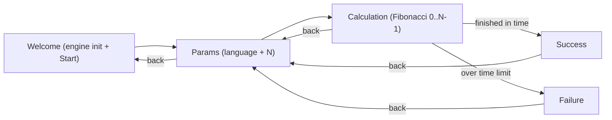
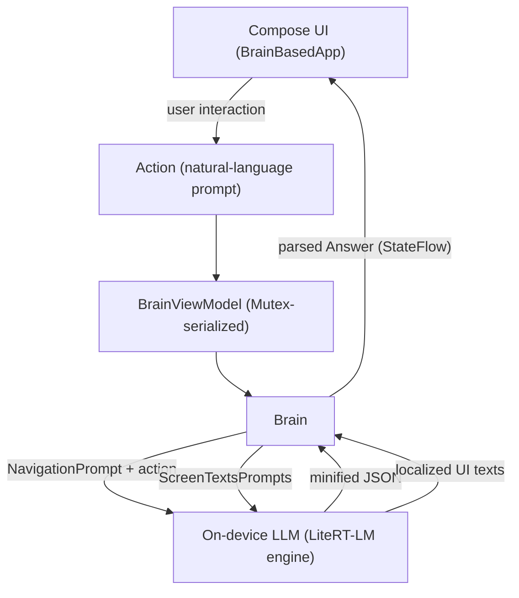

# ai-powered-demo-app

An experimental Android application whose **navigation and every piece of on-screen text are produced by an on-device Large Language Model (LLM)** instead of hardcoded logic. The model runs entirely on the device through [Google AI Edge LiteRT-LM](https://github.com/google-ai-edge/LiteRT-LM) — no network calls, no server.

The app calls this model the **Brain**. Each user interaction is turned into a short natural-language description, sent to the Brain, and the Brain decides which screen to show next and writes all the UI strings (titles, hints, buttons, messages) in whatever language the user asks for.

A small Fibonacci calculator is used as the demo scenario to show the idea end to end, including a time limit that is judged by the model rather than by an `if` statement.

---

## Highlights

- **LLM as the navigator.** There is no explicit navigation graph driving the flow. The Brain receives the current state plus a description of what the user did and replies with the next screen as JSON.
- **AI-generated, multilingual UI.** Type any language on the parameters screen (for example `English`, `Polish`, `Spanish`, `Japanese`) and every label and message is regenerated in that language on the fly.
- **Fully on-device.** Inference runs locally via LiteRT-LM with a Gemma model and the GPU backend by default. Nothing leaves the device.
- **Two "personalities" of the same model.** Low temperature for predictable navigation decisions, high temperature for creative screen copy.
- **Modern Android stack.** 100% Kotlin, Jetpack Compose, Material 3, MVVM with `StateFlow`.

---

## Demo flow



1. **Welcome** — initializes the on-device engine and shows the model name. The "Start the Brain" button is enabled only once the engine is ready.
2. **Params** — the user enters the UI language and `N` (the length of the Fibonacci sequence). All texts on this screen are generated by the model.
3. **Calculation** — computes the Fibonacci sequence for `0..N-1` using a deliberately naive recursive algorithm, while a timer ticks every second and intermediate values stream into a list.
4. **Success / Failure** — the calculation must finish within a 10-second limit. Crucially, the decision of "did this take too long?" is delegated to the Brain: the app reports elapsed seconds to the model, and the model navigates to **Failure** or **Success** accordingly.

With a large enough `N`, the naive recursion gets slow and crosses the time limit, which is how the Failure path is demonstrated.

---

## Architecture

The app is built around a simple, repeating loop: a user interaction becomes an `Action`, the `Brain` consults the LLM, and the LLM produces an `Answer` that selects and renders the next screen.



### Core pieces

| Component | File | Responsibility |
| --- | --- | --- |
| `Brain` | [app/src/main/kotlin/com/pierudzki/aipowereddemoapp/ai/Brain.kt](app/src/main/kotlin/com/pierudzki/aipowereddemoapp/ai/Brain.kt) | Holds app state (`appLanguage`, `n`), turns actions into LLM conversations, parses JSON responses into `Answer`s, and generates per-screen texts. Exposes everything as `StateFlow`. |
| `EngineWrapper` | [app/src/main/kotlin/com/pierudzki/aipowereddemoapp/ai/EngineWrapper.kt](app/src/main/kotlin/com/pierudzki/aipowereddemoapp/ai/EngineWrapper.kt) | Owns the LiteRT-LM `Engine` lifecycle and exposes `EngineState` (`Initializing` / `Ready` / `Error`). |
| `BrainViewModel` | [app/src/main/kotlin/com/pierudzki/aipowereddemoapp/ai/BrainViewModel.kt](app/src/main/kotlin/com/pierudzki/aipowereddemoapp/ai/BrainViewModel.kt) | `AndroidViewModel` that initializes/closes the engine and serializes navigation actions with a `Mutex`. Text generation runs outside the lock so it never blocks navigation. |
| `BrainBasedApp` | [app/src/main/kotlin/com/pierudzki/aipowereddemoapp/ai/BrainBasedApp.kt](app/src/main/kotlin/com/pierudzki/aipowereddemoapp/ai/BrainBasedApp.kt) | Collects the current `Answer` and delegates rendering to it via `answer.Content(brainViewModel)` — no `when`/branching. Each `Answer` renders its own screen. |

### Actions (input)

Every interaction implements the `Action` interface ([Action.kt](app/src/main/kotlin/com/pierudzki/aipowereddemoapp/ai/action/Action.kt)) and carries a `prompt` describing what happened in plain English:

- `UserIsReadyToStartUsingBrain` — the Start button on Welcome was tapped.
- `UserChangedAppLanguage(newLanguage)` — the language was changed on Params.
- `UserFinishedSettingUpParams(n)` — parameters confirmed; proceed to calculation.
- `CalculationDurationUpdated(durationSeconds)` — periodic timer tick. Marked `isDroppableWhenBusy = true`, so ticks are skipped while the Brain is busy.
- `CalculationFinished(durationSeconds)` — the calculation completed.
- `UserPressedBackButton` — the system back button was pressed.

### Answers (output)

The Brain parses the model's JSON into a sealed `Answer` ([Answer.kt](app/src/main/kotlin/com/pierudzki/aipowereddemoapp/ai/answer/Answer.kt)) that maps one-to-one to a screen: `ShowWelcomeScreen`, `ShowParamsSettingScreenAndRefreshTexts`, `ShowCalculationScreen`, `ShowSuccessScreen`, `ShowFailureScreen`.

Each `Answer` renders its own screen. The interface declares a single `@Composable fun Content(brainViewModel: BrainViewModel)`, and every subclass implements it — collecting the state it needs, running its effects, and wiring UI events back to `Action`s. This is a "replace conditional with polymorphism" approach: `BrainBasedApp` contains no `when`/branching and simply calls `answer.Content(brainViewModel)`. Per-screen data such as `n` and `appLanguage` is carried in each `Answer`'s constructor, while the shared `BrainViewModel` (state flows, action dispatch, text refresh) is passed into `Content(...)`.

### Prompts

- [NavigationPrompt.kt](app/src/main/kotlin/com/pierudzki/aipowereddemoapp/ai/prompt/NavigationPrompt.kt) — the system instruction for navigation. It lists the available screens, the current state, the routing rules, and demands a single minified JSON object: `{"screen": "...", "n": <int>, "appLanguage": "..."}`.
- [ScreenTextsPrompts.kt](app/src/main/kotlin/com/pierudzki/aipowereddemoapp/ai/prompt/ScreenTextsPrompts.kt) — one prompt per screen that asks the model to produce localized UI strings as JSON.

---

## Tech stack

| Area | Choice |
| --- | --- |
| Language | Kotlin 2.2.10 |
| UI | Jetpack Compose, Material 3 |
| On-device AI | Google AI Edge LiteRT-LM `0.13.1` |
| Model | Gemma (`gemma-4-E4B-it.litertlm`) |
| Architecture | MVVM, `StateFlow`, Kotlin coroutines |
| Build | Android Gradle Plugin 9.2.1, Gradle 9.4.1 |
| SDK | `compileSdk 37`, `minSdk 26`, `targetSdk 36` |
| Java | 11 (with core library desugaring) |
| License | Apache 2.0 |

---

## Project structure

```text
app/src/main/kotlin/com/pierudzki/aipowereddemoapp/
├── ai/                         # The "Brain" and everything LLM-related
│   ├── Brain.kt                # State + LLM conversations + response parsing
│   ├── BrainViewModel.kt       # Engine lifecycle, action serialization
│   ├── BrainBasedApp.kt        # Delegates rendering to the current Answer
│   ├── EngineWrapper.kt        # LiteRT-LM engine lifecycle and state
│   ├── ModelConfig.kt          # Model file name and on-device path
│   ├── action/                 # User/system interactions (Action prompts)
│   ├── answer/                 # Sealed Answer types; each renders its own screen
│   └── prompt/                 # NavigationPrompt + ScreenTextsPrompts
└── core/                       # Compose screens, ViewModels, theme
    ├── MainActivity.kt
    ├── WelcomeScreen.kt
    ├── ParamsSettingScreen.kt
    ├── CalculationScreen.kt + CalculationScreenViewModel.kt
    ├── ui/ (SuccessScreen, FailureScreen, theme/)
    └── *Texts.kt               # Data classes holding AI-generated texts
```

---

## Prerequisites

- **Android Studio** (latest stable) or the Android command-line tools with the Gradle wrapper.
- **JDK 11+**.
- A **physical device or emulator** running **Android 8.0 (API 26)** or higher.
- A **GPU-capable device is recommended.** The engine defaults to `Backend.GPU()` in [EngineWrapper.kt](app/src/main/kotlin/com/pierudzki/aipowereddemoapp/ai/EngineWrapper.kt). On devices without a usable GPU, switch to `Backend.CPU()` there.
- `adb` available on your `PATH` (to push the model file).

---

## Model setup

The model is **not bundled in the APK** because it is too large. During development it is pushed to the device with `adb`. The app expects it at the path defined in [ModelConfig.kt](app/src/main/kotlin/com/pierudzki/aipowereddemoapp/ai/ModelConfig.kt):

```text
/data/local/tmp/llm/gemma-4-E4B-it.litertlm
```

Push the model file to the device:

```bash
adb shell mkdir -p /data/local/tmp/llm
adb push gemma-4-E4B-it.litertlm /data/local/tmp/llm/gemma-4-E4B-it.litertlm
```

If the model is missing, the Welcome screen surfaces an **error state** instead of enabling the Start button (`EngineState.Error`, see [EngineWrapper.kt](app/src/main/kotlin/com/pierudzki/aipowereddemoapp/ai/EngineWrapper.kt)).

> Note: obtain a LiteRT-LM-compatible Gemma model file and rename/match it to the expected file name, or update `MODEL_FILE_NAME` in `ModelConfig.kt` to match your file.

---

## Build and run

Using the Gradle wrapper:

```bash
# Build the debug APK
./gradlew :app:assembleDebug

# Install and launch on a connected device/emulator
./gradlew :app:installDebug
```

Or open the project in Android Studio and press **Run**.

Make sure the model file has been pushed (see [Model setup](#model-setup)) before launching, otherwise the Brain cannot start.

---

## How it works in detail

- **One conversation per action.** For each navigation `Action`, the Brain creates a fresh LiteRT-LM conversation using `NavigationPrompt` as the system instruction and sends the action's `prompt`. The model replies with minified JSON, which the Brain extracts (first `{` to last `}`) and parses into an `Answer` while updating `appLanguage` and `n`.
- **Two sampler configurations.** Navigation uses a low temperature (`temperature = 0.2`) so routing stays deterministic and reliable; screen texts use a high temperature (`temperature = 1.0`) to keep the copy varied and natural. Both are defined in [Brain.kt](app/src/main/kotlin/com/pierudzki/aipowereddemoapp/ai/Brain.kt).
- **The time limit is an AI decision.** `CalculationScreenViewModel` runs the recursive `fib(...)` and emits `CalculationDurationUpdated` ticks plus a final `CalculationFinished`. The Brain — guided by the rules in `NavigationPrompt` and the 10-second limit — decides whether to route to Success or Failure. The app does not contain a hardcoded timeout branch for navigation.
- **Concurrency safety.** Navigation actions are serialized through a `Mutex` in `BrainViewModel`. High-frequency ticks (`CalculationDurationUpdated`) are droppable: if the Brain is busy, they are skipped via `tryLock()` so the model is never flooded. Text generation runs on a separate path and does not block navigation.
- **Resilient parsing.** If the model returns malformed output, the Brain falls back to the previous answer or to predefined fallback texts, so the UI never crashes on a bad generation.

---

## Limitations and notes

- This is a **demo / proof of concept**, not a production app. LLM-driven navigation is inherently less deterministic than a conventional navigation graph.
- The model file must be provisioned manually via `adb`. For a real product it should be downloaded at runtime (as noted in [ModelConfig.kt](app/src/main/kotlin/com/pierudzki/aipowereddemoapp/ai/ModelConfig.kt)).
- The `navigation-compose` dependency is present in the build, but the actual flow is **state-driven** by the `Brain` (the rendered screen follows the current `Answer`), not a `NavHost`.
- On-device inference performance depends heavily on the device and the chosen backend (GPU vs CPU).

---

## License

This project is licensed under the **Apache License 2.0**. See [LICENSE](LICENSE) for details.
