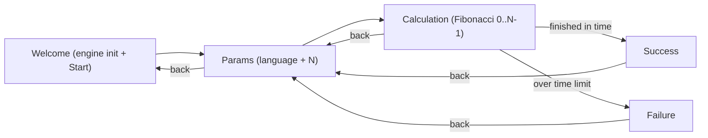
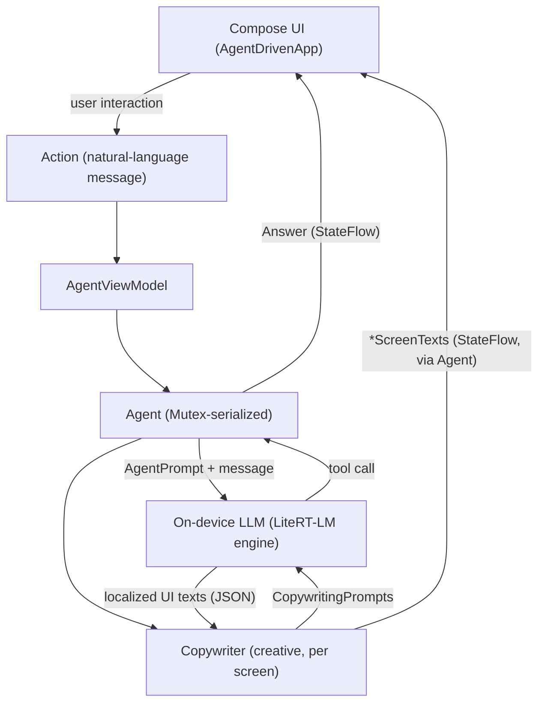

# ai-powered-demo-app

An experimental Android application whose **navigation and the texts of every Agent-driven screen (titles, hints, buttons, messages) are produced by an on-device Large Language Model (LLM)** instead of hardcoded logic. The model runs entirely on the device through [Google AI Edge LiteRT-LM](https://github.com/google-ai-edge/LiteRT-LM) — no network calls, no server.

The app wraps this model in an **Agent**: a Kotlin class that holds the conversation with the model and the screen tools the model can call. Each user interaction is turned into a short natural-language description and sent to the Agent; the model decides which screen to show next by calling one of the Agent's tools, and writes all the UI strings (titles, hints, buttons, messages) in whatever language the user asks for.

In this README *the model* (or *the LLM*) means Gemma running in the LiteRT-LM engine, *the Agent* means the Kotlin class that wraps it, and *the Copywriter* means the Kotlin class through which the Agent asks the model for each screen's texts. The model writes the copy; the Agent and the Copywriter only ask, parse and publish.

A small Fibonacci calculator is used as the demo scenario to show the idea end to end, including a time limit that is judged by the model rather than by an `if` statement.

---

## Highlights

- **LLM as the navigator.** There is no explicit navigation graph driving the flow. The Agent keeps a running conversation with the model, feeds it a description of what the user did, and the model navigates by calling exactly one of the Agent's screen tools (function calling).
- **AI-generated, multilingual UI.** Type any language on the parameters screen (for example `English`, `Polish`, `Spanish`, `Japanese`) and every label and message is regenerated in that language on the fly. Texts are written anew every time a screen is shown, so the wording changes a little from visit to visit.
- **Fully on-device.** Inference runs locally via LiteRT-LM with a Gemma model and the GPU backend by default. Nothing leaves the device.
- **Two "personalities" of the same model.** Low temperature for predictable navigation decisions (the `Agent`'s navigation conversation), high temperature for creative screen copy (the `Agent`'s `Copywriter`).
- **Modern Android stack.** 100% Kotlin, Jetpack Compose, Material 3, MVVM with `StateFlow`.

---

## Demo flow


```mermaid
flowchart LR
    Welcome["Welcome (engine init + Start)"] --> Params["Params (language + N)"]
    Params --> Calculation["Calculation (Fibonacci 0..N-1)"]
    Calculation -->|"finished in time"| Success["Success"]
    Calculation -->|"over time limit"| Failure["Failure"]
    Params -->|back| Welcome
    Calculation -->|back| Params
    Success -->|back| Params
    Failure -->|back| Params
```

1. **Welcome** — initializes the on-device engine and shows the model name. The "Start the Agent" button is enabled only once the engine is ready.
2. **Params** — the user enters the UI language and `N` (the length of the Fibonacci sequence). All texts on this screen are generated by the model.
3. **Calculation** — computes the Fibonacci sequence for `0..N-1` using a deliberately naive recursive algorithm, while a timer ticks every second and intermediate values stream into a list.
4. **Success / Failure** — the calculation must finish within a 10-second limit. Crucially, the decision of "did this take too long?" is delegated to the model: the Agent reports only the elapsed seconds (the limit itself lives in the navigation system prompt), and the model navigates to **Failure** or **Success** accordingly.

With a large enough `N`, the naive recursion gets slow and crosses the time limit, which is how the Failure path is demonstrated.

---

## Architecture

The app is built around a simple, repeating loop: a user interaction becomes an `Action`, the `Agent` consults the LLM, and the LLM produces an `Answer` that selects and renders the next screen.


```mermaid
flowchart TD
    UI["Compose UI (AgentDrivenApp)"] -->|"user interaction"| Action["Action (natural-language message)"]
    Action --> VM["AgentViewModel"]
    VM --> Agent["Agent (Mutex-serialized)"]
    Agent -->|"AgentPrompt + message"| LLM["On-device LLM (LiteRT-LM engine)"]
    LLM -->|"tool call"| Agent
    Agent -->|"Answer (StateFlow)"| UI
    Agent --> Copywriter["Copywriter (creative, per screen)"]
    Copywriter -->|"CopywritingPrompts"| LLM
    LLM -->|"localized UI texts (JSON)"| Copywriter
    Copywriter -->|"*ScreenTexts (StateFlow, via Agent)"| UI
```

### Core pieces

| Component | File | Responsibility |
| --- | --- | --- |
| `Agent` | [app/src/main/kotlin/com/pierudzki/aipowereddemoapp/ai/Agent.kt](app/src/main/kotlin/com/pierudzki/aipowereddemoapp/ai/Agent.kt) | Keeps a navigation conversation that is reused within a calculation run but recreated at the start of each new run (so stale timing history can't skew the limit decision); `appLanguage` and `n` live in the model's own context within a run and are re-seeded via `UserFinishedSettingUpParams` when a new run begins. Turns actions into messages, lets the model navigate by calling tools, and generates per-screen texts through the `Copywriter` it owns (the model's second personality), which it also closes. Serializes navigation turns with a `Mutex` it owns, drops actions flagged `isDroppableWhenBusy` while a turn is in flight, and closes the conversation and the engine under the same lock once in-flight text generations have finished. Exposes everything as `StateFlow`. |
| `Copywriter` | [app/src/main/kotlin/com/pierudzki/aipowereddemoapp/ai/Copywriter.kt](app/src/main/kotlin/com/pierudzki/aipowereddemoapp/ai/Copywriter.kt) | The model's second personality, owned by the `Agent`. For each of the params, calculation, success and failure screens it opens a short single-turn, tool-less conversation whose system instruction is that screen's prompt (`CopywritingPrompts`) at `temperature = 1.0`, parses the JSON reply leniently and publishes typed `*ScreenTexts` via one `StateFlow` per screen. Generates the texts anew every time a screen is shown or re-created — nothing is cached, on purpose, so the same screen in the same language reads slightly differently on each visit and the model's creativity stays visible; while it writes, the screen shows "Loading..." placeholders. Shows an explicit "Text generation failed" placeholder when a reply is unusable, serializes requests per screen with its own `Mutex` (so the last requested language always ends up on screen), and is cancelled and awaited by `Agent.close()`. |
| `EngineHolder` | [app/src/main/kotlin/com/pierudzki/aipowereddemoapp/ai/EngineHolder.kt](app/src/main/kotlin/com/pierudzki/aipowereddemoapp/ai/EngineHolder.kt) | Holds the single LiteRT-LM `Engine` instance: creates and initializes it (model file check, `EngineConfig`, GPU backend), closes it, and exposes `EngineState` (`Initializing` / `Ready` / `Error`). |
| `AgentViewModel` | [app/src/main/kotlin/com/pierudzki/aipowereddemoapp/ai/AgentViewModel.kt](app/src/main/kotlin/com/pierudzki/aipowereddemoapp/ai/AgentViewModel.kt) | `AndroidViewModel` that is pure lifecycle glue: owns the coroutine scope, initializes the engine, closes the Agent in `onCleared()`, forwards actions to the Agent and maps `EngineState` to the Welcome screen UI state. |
| `AgentDrivenApp` | [app/src/main/kotlin/com/pierudzki/aipowereddemoapp/ai/AgentDrivenApp.kt](app/src/main/kotlin/com/pierudzki/aipowereddemoapp/ai/AgentDrivenApp.kt) | Collects the current `Answer` and delegates rendering to it via `answer.Content(agentViewModel)` — no `when`/branching. Each `Answer` renders its own screen. |

### Actions (input)

Every interaction implements the `Action` interface ([Action.kt](app/src/main/kotlin/com/pierudzki/aipowereddemoapp/ai/action/Action.kt)) and carries a `message` describing what happened in plain English:

- `UserPressedStartButton` — the Start button on Welcome was tapped.
- `UserChangedAppLanguage(newLanguage)` — the language was changed on Params.
- `UserFinishedSettingUpParams(n, appLanguage)` — parameters confirmed; proceed to calculation. Flagged `startsFreshNavigationConversation = true`, so it recreates the navigation conversation for the new run and carries `n` and `appLanguage` into its first message.
- `CalculationDurationUpdated(durationSeconds)` — periodic timer tick that reports only the elapsed seconds; the time limit lives solely in the system prompt. Marked `isDroppableWhenBusy = true`, so ticks are skipped while the Agent is busy.
- `CalculationFinished(durationSeconds)` — the calculation completed.
- `UserPressedBackButton` — the system back button was pressed.

### Answers (output)

The model selects a screen by calling one of the Agent's navigation tools, and each tool sets the current sealed `Answer` ([Answer.kt](app/src/main/kotlin/com/pierudzki/aipowereddemoapp/ai/answer/Answer.kt)) that maps one-to-one to a screen: `ShowWelcomeScreen`, `ShowParamsSettingScreen`, `ShowCalculationScreen`, `ShowSuccessScreen`, `ShowFailureScreen`.

Each `Answer` renders its own screen. The interface declares a single `@Composable fun Content(agentViewModel: AgentViewModel)`, and every subclass implements it — collecting the state it needs, running its effects, and wiring UI events back to `Action`s. This is a "replace conditional with polymorphism" approach: `AgentDrivenApp` contains no `when`/branching and simply calls `answer.Content(agentViewModel)`. Per-screen data such as `n` and `appLanguage` is carried in each `Answer`'s constructor, while the shared `AgentViewModel` (state flows, action dispatch, text refresh) is passed into `Content(...)`.

### Prompts

- [AgentPrompt.kt](app/src/main/kotlin/com/pierudzki/aipowereddemoapp/ai/prompt/AgentPrompt.kt) — the Agent's system instruction for navigation. It lists the available screens and their tools, tells the model to remember `n` and `appLanguage` across the conversation (defaulting to `10` and `English`), explains that every message is prefixed with the current screen, and states the time limit. The model navigates by calling exactly one tool — no text or JSON — with one exception: on the calculation screen while still within the time limit it replies with the single word `WAIT` instead of calling a tool, so the screen is not needlessly re-issued every tick.
- [CopywritingPrompts.kt](app/src/main/kotlin/com/pierudzki/aipowereddemoapp/ai/prompt/CopywritingPrompts.kt) — one copywriting prompt per screen, used by the `Copywriter` as the system instruction of a fresh single-turn conversation: what the screen does, which texts it needs and their length limits, the requested language, and an instruction to answer with a single minified JSON object using fixed keys.

---

## Tech stack

| Area | Choice                                       |
| --- |----------------------------------------------|
| Language | Kotlin 2.2.10                                |
| UI | Jetpack Compose, Material 3                  |
| On-device AI | Google AI Edge LiteRT-LM `0.13.1`            |
| Model | Gemma (`gemma-4-E4B-it.litertlm`)            |
| Architecture | MVVM, `StateFlow`, Kotlin coroutines         |
| Build | Android Gradle Plugin 9.2.1, Gradle 9.4.1    |
| SDK | `compileSdk 37`, `minSdk 36`, `targetSdk 36` |
| Java | 11 (with core library desugaring)            |
| License | Apache 2.0                                   |

---

## Project structure

```text
app/src/main/kotlin/com/pierudzki/aipowereddemoapp/
├── ai/                          # The Agent and everything LLM-related
│   ├── Agent.kt                 # Navigation conversation (recreated per run), tools, action serialization
│   ├── AgentViewModel.kt        # Lifecycle glue: scope, engine init/close, UI-state mapping
│   ├── AgentDrivenApp.kt        # Delegates rendering to the current Answer
│   ├── EngineHolder.kt          # Holds the LiteRT-LM engine; lifecycle and state
│   ├── Copywriter.kt            # Localized per-screen texts (high temp): one short conversation per screen visit, no cache
│   ├── ModelConfig.kt           # Model file name and on-device path
│   ├── action/                  # User/system interactions (Action messages)
│   ├── answer/                  # Sealed Answer types; each renders its own screen
│   └── prompt/                  # AgentPrompt + CopywritingPrompts
└── core/                        # Compose UI: screens, ViewModel, texts, theme
    ├── MainActivity.kt
    ├── AppDestination.kt         # Screen catalog (enum: id + description)
    ├── WelcomeScreen.kt
    ├── ParamsSettingScreen.kt
    ├── CalculationScreen.kt + CalculationScreenViewModel.kt
    ├── SuccessScreen.kt, FailureScreen.kt
    ├── *Texts.kt                 # Data classes holding AI-generated texts
    └── ui/theme/                 # Material 3 color, type, theme
```

---

## Prerequisites

- **Android Studio** (latest stable) or the Android command-line tools with the Gradle wrapper.
- **JDK 11+**.
- A **physical device or emulator** running **Android 16.0 (API 36)** or higher.
- A **GPU-capable device is recommended.** The engine defaults to `Backend.GPU()` in [EngineHolder.kt](app/src/main/kotlin/com/pierudzki/aipowereddemoapp/ai/EngineHolder.kt). On devices without a usable GPU, switch to `Backend.CPU()` there.
- `adb` available on your `PATH` (to push the model file).

---

## Model setup

The model is **not bundled in the APK** because it is too large. During development it is pushed to the device with `adb`. The app expects it at the path defined in [ModelConfig.kt](app/src/main/kotlin/com/pierudzki/aipowereddemoapp/ai/ModelConfig.kt):

```text
/data/local/tmp/llm/gemma-4-E4B-it.litertlm
```

**1. Download the model.** The file is published on Hugging Face by `litert-community` and can be downloaded directly from this link (about 3.7 GB): [gemma-4-E4B-it.litertlm](https://huggingface.co/litert-community/gemma-4-E4B-it-litert-lm/resolve/main/gemma-4-E4B-it.litertlm?download=true). The downloaded file already has the name the app expects. From the terminal:

```bash
curl -L -o gemma-4-E4B-it.litertlm "https://huggingface.co/litert-community/gemma-4-E4B-it-litert-lm/resolve/main/gemma-4-E4B-it.litertlm?download=true"
```

**2. Push the model file to the device:**

```bash
adb shell mkdir -p /data/local/tmp/llm
adb push gemma-4-E4B-it.litertlm /data/local/tmp/llm/gemma-4-E4B-it.litertlm
```

If the model is missing, the Welcome screen surfaces an **error state** instead of enabling the Start button (`EngineState.Error`, see [EngineHolder.kt](app/src/main/kotlin/com/pierudzki/aipowereddemoapp/ai/EngineHolder.kt)).

> Note: if you use a different LiteRT-LM-compatible Gemma model file, rename it to the expected file name or update `MODEL_FILE_NAME` in `ModelConfig.kt` to match your file.

---

## Build and run

Using the Gradle wrapper:

```bash
# Build the debug APK
./gradlew :app:assembleDebug

# Install and launch on a connected device/emulator
./gradlew :app:installDebug
```

Or open the project in Android Studio and press **Run**.

Make sure the model file has been pushed (see [Model setup](#model-setup)) before launching, otherwise the engine cannot start.

---

## How it works in detail

- **Navigation conversation, recreated per run.** The Agent uses a single LiteRT-LM conversation (with `AgentPrompt` as the system instruction) and reuses it across turns, but it recreates the conversation at the start of each new calculation run - when `UserFinishedSettingUpParams` arrives (flagged via `startsFreshNavigationConversation`) the Agent calls `resetNavigationConversation()` first - so stale timing history from a previous run cannot leak in and skew limit detection. Because a fresh conversation has no memory, that action carries the confirmed `n` and `appLanguage` in its first message; within a run they are then remembered by the model across turns instead of being cached in the app. Each message is prefixed with the authoritative current screen. The model navigates by calling exactly one tool, which updates the current `Answer`; the exception is the calculation screen while still within the time limit, where the model replies `WAIT` and the current `Answer` is left unchanged.
- **Two personalities, two sampler configurations.** Navigation uses a low temperature (`temperature = 0.2`) so routing stays deterministic and reliable (defined in [Agent.kt](app/src/main/kotlin/com/pierudzki/aipowereddemoapp/ai/Agent.kt)); screen texts use a high temperature (`temperature = 1.0`) to keep the copy varied and natural (defined in [Copywriter.kt](app/src/main/kotlin/com/pierudzki/aipowereddemoapp/ai/Copywriter.kt)). Each screen's texts come from a fresh single-turn conversation without tools, so a creative reply can never leak into the navigation history. Screen texts are never cached: each time a screen is shown the model writes them again, which is what makes its creativity visible in a demo (a real product would cache per language).
- **The time limit is an AI decision.** `CalculationScreenViewModel` runs the recursive `fib(...)` and emits `CalculationDurationUpdated` ticks plus a final `CalculationFinished`. Each tick carries only the elapsed seconds; the hard limit is defined once in `AgentPrompt` (the system instruction), which the model must remember and compare against the elapsed seconds on every message: while still within the limit it replies with the single word `WAIT` (no navigation, so the calculation screen stays put), and it switches to Failure once the elapsed time passes the limit. The app does not contain a hardcoded timeout branch for navigation.
- **Concurrency safety.** Navigation actions are serialized through a `Mutex` owned by the `Agent` itself, so the Agent is correct no matter who calls it. High-frequency ticks (`CalculationDurationUpdated`) are droppable: if the Agent is busy, they are skipped via `tryLock()` so the model is never flooded. Text generation runs on a separate path: one short conversation per screen, serialized per screen by the `Copywriter`'s own `Mutex`es (requests for one screen run one after another in call order, each one a fresh generation, so the last requested language always wins; a request that arrives while one is in flight, e.g. after a rotation, waits and then generates again), never under the navigation `Mutex`, so it never blocks navigation. Teardown takes the same lock: `Agent.close()` (called from `onCleared()`) asks the in-flight turn to cancel and then closes the conversation and the engine only once that turn has released the lock, so the navigation conversation's native handles are never freed mid-turn. Teardown covers both paths: `Agent.close()` first refuses new text generations and asks in-flight ones to cancel (`Copywriter.close()`), waits for them to finish (`awaitIdle()`), and only then closes the navigation conversation and the engine under the navigation lock.
- **Resilient by design.** A failed navigation turn simply leaves the current `Answer` unchanged, and text generation parses the model's JSON leniently (code fences around the object are ignored, a missing or blank field falls back individually), shows an explicit "Text generation failed" placeholder when a reply is unusable, so the UI never crashes on a bad generation; since every visit asks the model again, a bad reply lasts only until the screen is shown next.

---

## Limitations and notes

- This is a **demo / proof of concept**, not a production app. LLM-driven navigation is inherently less deterministic than a conventional navigation graph.
- The model file must be provisioned manually via `adb`. For a real product it should be downloaded at runtime (as noted in [ModelConfig.kt](app/src/main/kotlin/com/pierudzki/aipowereddemoapp/ai/ModelConfig.kt)).
- The `navigation-compose` dependency is present in the build, but the actual flow is **state-driven** by the `Agent` (the rendered screen follows the current `Answer`), not a `NavHost`.
- On-device inference performance depends heavily on the device and the chosen backend (GPU vs CPU).
- Screen texts are generated anew on every visit and on every configuration change (rotation, dark mode): each costs one short on-device inference. This is deliberate — it shows the model's creativity; a real product would cache per language. On fast calculations the calculation screen is usually left before its texts arrive.

---

## License

This project is licensed under the **Apache License 2.0**. See [LICENSE](LICENSE) for details.
